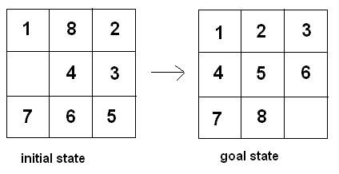

# Sliding-Puzzle-Game
*	Project Title: Sliding Puzzle Game
*	Project Overview: As the system is login based, user will have to login by putting name and password. After login, the game will automatically start a new game window.

*	Project Details: This is a number puzzle game where there will be given a n×n board with n^2-1 tiles (every tile has one number from 1 to n^2-1) and one empty space. The objective is to place the numbers on tiles to match final configuration using the empty space. We can slide four sides (left, right, above and below) tiles into the empty space. The Goal is to arrange the numbers in ascending order from left to right. For example, if user enters 3 as a input : 

   

*	Inside The Project: This OOP based project will have single class for each portion. And it will be based on SWING
